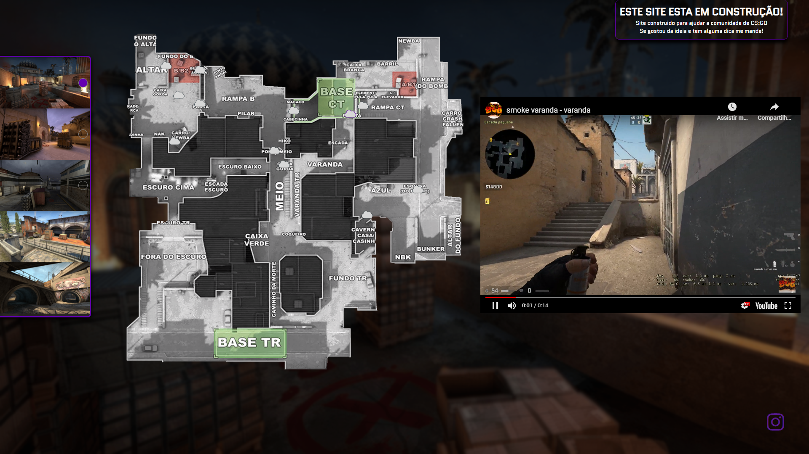

<h1 align="center">CounterStrategy</h1>

Site para ajudar a gameplay de quem joga Counter-Strike Global Offensive

 
  
 

  
 

  

  <a align="center" href="https://robertds07.github.io/CounterStrategy/">Site</a>

# Porque fiz?
• Fiz porque com o tempo jogando eu percebi que independende da patente sempre há muitos players que não sabem algumas smokes, e não da para ficar procurando um vídeo que normalmente tem 3 minutos para ver uma só smoke, então pensei em fazer algo que vá direto ao ponto, simples, rápido e prático, para poder ser acessado enquanto joga.

# O que vem nas próximas releases?
• Flashbangs  
• Molotovs

 Aceitando sugestões e críticas 

